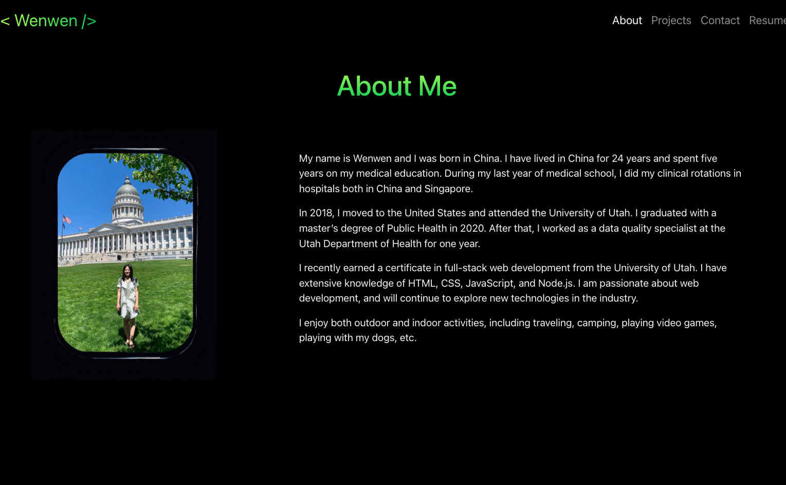
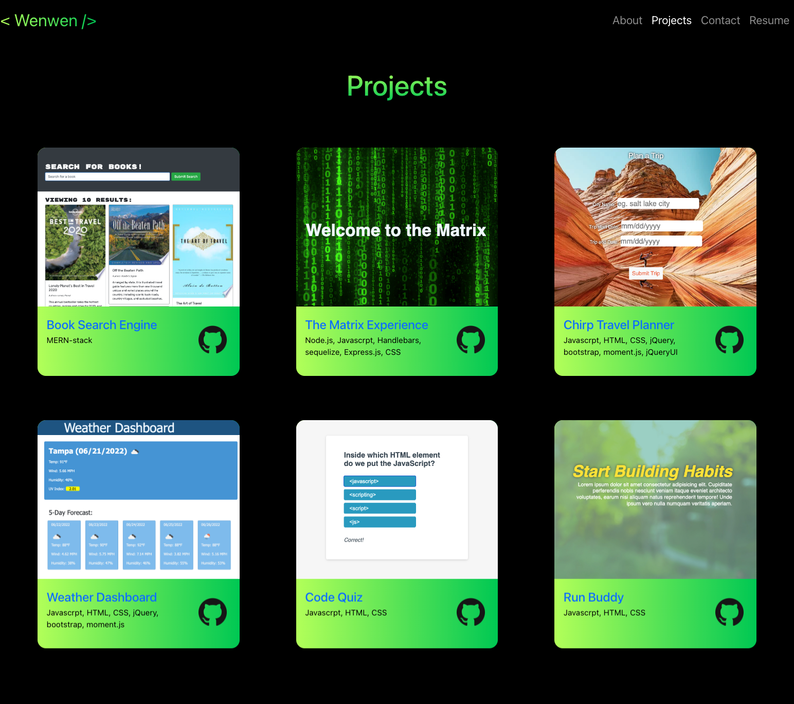

# React Portfolio

## Table of Contents

- [Description](#description)
- [Technology](#Technology)
- [Installation](#installation)
- [Usage](#usage)
- [License](#license)
- [Contribution](#contribution)
- [Questions](#questions)

## Description:

My first React porfolio! It includes the introduction of myself, my projects, the way to contact me, and my resume.

## Technology:

Project is created with:

- React.js
- Javascript
- Node.js
- React Bootstrap
- Bootstrap

## Installation

To run this project, install it locally using npm:

```
npm install
```

## Usage

After installing npm packages, the application will be invoked by using the following command:

```
npm start
```

#### Deployment

Install gh-pages:

```
npm install -D gh-pages
```

Edit package.json:

```json
"homepage": "http://<username>.github.io/photo-port",
"predeploy": "npm run build",
"deploy": "gh-pages -d build",
```

Then run:

```
npm run deploy
```

[Click me to see my React portfolio!](https://joce1ynn.github.io/portfolio-React/)

#### Portfolio Screenshot






## License

[](https://opensource.org/licenses/MIT) <br>
This project is licensed under MIT, for more information please visit [this website](https://opensource.org/licenses/MIT)

## Contribution
Icons are from Flaticon.com
Made with ❤️ by Wenwen Tian

## Questions?

Please feel free to contact me if you need any further information:

- [Email](wwtian9@gmail.com)
- [Github Profile](https://github.com/joce1ynn)
